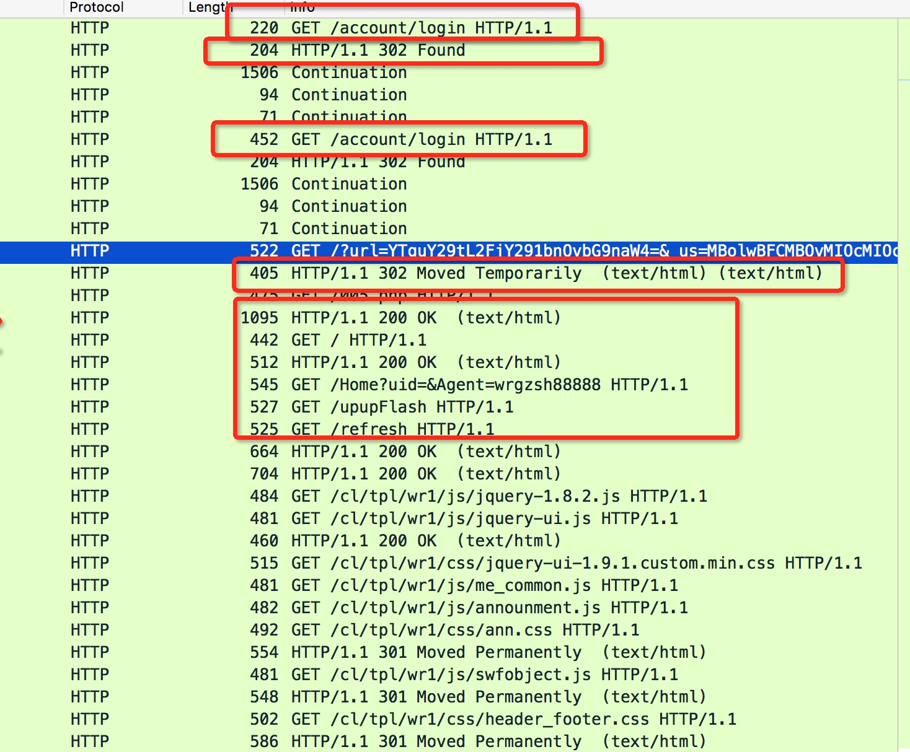

a8.com
---
注意到一个很有意思的点，curl连接拿到结果之后，连接一直没有断开。
用浏览器会被跳转到一些赌博网站的网页。

目前不清楚是对方服务器被攻击还是在传输过程中被篡改了。



## 使用curl访问
```shell
curl -H "User-Agent: Mozilla/5.0 (Macintosh; Intel Mac OS X 10.12; rv:55.0) Gecko/20100101 Firefox/55.0" -v http://a8.com/account/login
```
WireShark抓包结果
```text
GET /account/login HTTP/1.1
Host: a8.com
Accept: */*
User-Agent: Mozilla/5.0 (Macintosh; Intel Mac OS X 10.12; rv:55.0) Gecko/20100101 Firefox/55.0

HTTP/1.1 302 Found
Connection: close
Location: http://45.77.3.121/?url=YTguY29tL2FjY291bnQvbG9naW4=&_us=MBolwBFCMBQ9MvOcMIOczkoCYPQOM1QLMF==YxOc

HTTP/1.1 200 OK
Server: nginx/1.10.1
Date: Mon, 03 Jul 2017 13:34:45 GMT
Content-Type: text/html; charset=utf-8
Transfer-Encoding: chunked
Connection: keep-alive
X-Powered-By: PHP/5.5.38
Set-Cookie: sess_a_id=2g15l9bcvnl8vu9a16phlr35a0; path=/; domain=a8.com
Expires: Thu, 19 Nov 1981 08:52:00 GMT
Cache-Control: no-store, no-cache, must-revalidate, post-check=0, pre-check=0
Pragma: no-cache

9bf
<!DOCTYPE html PUBLIC "-//W3C//DTD XHTML 1.0 Transitional//EN"
"http://www.w3.org/TR/xhtml1/DTD/xhtml1-transitional.dtd">
<html xmlns="http://www.w3.org/1999/xhtml">
<head>
<title>登录 - A8音乐网内容管理系统</title>
<meta http-equiv="Content-Type" content="text/html; charset=utf-8" />
<link href="http://main.a8-img.com/static/web/admin/ui/themes/css/login.css" rel="stylesheet" type="text/css" media="screen"/>
</head>
<body>
<div class="wrap">
    <div class="top"></div>
    <div class="left"></div>
    <div class="middle">
        <form name="login" method="POST" action="http://a8.com/account/login" id="loginForm">
        <div class="username"><input name="username" type="text" /></div>
        <div class="password"><input name="password" type="password" /></div>
        <div class="verifycode"><input name="code" type="text" autocomplete="off" /></div>
        <div class="submit"><a href="javascript:;" onclick="$('#loginForm').submit();"></a></div>
        </form>
        <div style="display:none;margin-left:58px" id="vcode"></div>
    </div>
    <div class="right"></div>
    <div class="bottom clearfix"></div>
</div>
</body>
<script src="http://main.a8-img.com/static/web/admin/js/jquery-1.7.2.js" type="text/javascript"></script>
<script type="text/javascript">
$(function(){
    $('#verifyCode').click(function(){
        $(this).attr('src', 'http://a8.com/captcha/get&'+Math.random());
    });
    $('input[name="code"]').focus(function(){
        $('#vcode').show();
    }).blur(function(){
        $('#vcode').hide();
    });
    $('#loginForm').submit(function(){
        var username = $('input[name="username"]'),
        password = $('input[name="password"]'),
        verifycode = $('input[name="code"]');
        if(username.val().length < 4)
        {
            alert('用户名不能为空或者小于4个字符');
            username.focus();
            return false;
        }
        else if(password.val().length < 6)
        {
            alert('密码不能为空或者小于6个字符');
            password.focus();
            return false;
        }
        else if(verifycode.val().length !== 4)
        {
            alert('验证码不能为空或者长度错误');
            verifycode.focus();
            return false;
        }
        return true;
    });
})
</script>
</html>
0


```


## 浏览器访问
```text
GET /account/login HTTP/1.1
Host: a8.com
User-Agent: Mozilla/5.0 (Macintosh; Intel Mac OS X 10.12; rv:55.0) Gecko/20100101 Firefox/55.0
Accept: text/html,application/xhtml+xml,application/xml;q=0.9,*/*;q=0.8
Accept-Language: zh-CN,en-US;q=0.8,zh-TW;q=0.7,zh-HK;q=0.5,zh;q=0.3,en;q=0.2
Accept-Encoding: gzip, deflate
DNT: 1
Connection: keep-alive
Upgrade-Insecure-Requests: 1

HTTP/1.1 302 Found
Connection: close
Location: http://45.77.3.121/?url=YTguY29tL2FjY291bnQvbG9naW4=&_us=MBolwBFCMBQvMIOcMIOczkoCYPQOM1QLMF==YxOc

HTTP/1.1 200 OK
Server: nginx/1.10.1
Date: Mon, 03 Jul 2017 13:35:52 GMT
Content-Type: text/html; charset=utf-8
Transfer-Encoding: chunked
Connection: keep-alive
X-Powered-By: PHP/5.5.38
Set-Cookie: sess_a_id=spmjsngv3m5f756774kkmbkqn0; path=/; domain=a8.com
Expires: Thu, 19 Nov 1981 08:52:00 GMT
Cache-Control: no-store, no-cache, must-revalidate, post-check=0, pre-check=0
Pragma: no-cache

9bf
<!DOCTYPE html PUBLIC "-//W3C//DTD XHTML 1.0 Transitional//EN"
"http://www.w3.org/TR/xhtml1/DTD/xhtml1-transitional.dtd">
<html xmlns="http://www.w3.org/1999/xhtml">
<head>
<title>登录 - A8音乐网内容管理系统</title>
<meta http-equiv="Content-Type" content="text/html; charset=utf-8" />
<link href="http://main.a8-img.com/static/web/admin/ui/themes/css/login.css" rel="stylesheet" type="text/css" media="screen"/>
</head>
<body>
<div class="wrap">
    <div class="top"></div>
    <div class="left"></div>
    <div class="middle">
        <form name="login" method="POST" action="http://a8.com/account/login" id="loginForm">
        <div class="username"><input name="username" type="text" /></div>
        <div class="password"><input name="password" type="password" /></div>
        <div class="verifycode"><input name="code" type="text" autocomplete="off" /></div>
        <div class="submit"><a href="javascript:;" onclick="$('#loginForm').submit();"></a></div>
        </form>
        <div style="display:none;margin-left:58px" id="vcode"></div>
    </div>
    <div class="right"></div>
    <div class="bottom clearfix"></div>
</div>
</body>
<script src="http://main.a8-img.com/static/web/admin/js/jquery-1.7.2.js" type="text/javascript"></script>
<script type="text/javascript">
$(function(){
    $('#verifyCode').click(function(){
        $(this).attr('src', 'http://a8.com/captcha/get&'+Math.random());
    });
    $('input[name="code"]').focus(function(){
        $('#vcode').show();
    }).blur(function(){
        $('#vcode').hide();
    });
    $('#loginForm').submit(function(){
        var username = $('input[name="username"]'),
        password = $('input[name="password"]'),
        verifycode = $('input[name="code"]');
        if(username.val().length < 4)
        {
            alert('用户名不能为空或者小于4个字符');
            username.focus();
            return false;
        }
        else if(password.val().length < 6)
        {
            alert('密码不能为空或者小于6个字符');
            password.focus();
            return false;
        }
        else if(verifycode.val().length !== 4)
        {
            alert('验证码不能为空或者长度错误');
            verifycode.focus();
            return false;
        }
        return true;
    });
})
</script>
</html>
0

```

### 浏览器里会看到的一些比较奇怪的请求
```text
GET /?url=YTguY29tL2FjY291bnQvbG9naW4=&_us=MBolwBFCMBQvMIOcMIOczkoCYPQOM1QLMF==YxOc HTTP/1.1
Host: 45.77.3.121
User-Agent: Mozilla/5.0 (Macintosh; Intel Mac OS X 10.12; rv:55.0) Gecko/20100101 Firefox/55.0
Accept: text/html,application/xhtml+xml,application/xml;q=0.9,*/*;q=0.8
Accept-Language: zh-CN,en-US;q=0.8,zh-TW;q=0.7,zh-HK;q=0.5,zh;q=0.3,en;q=0.2
Accept-Encoding: gzip, deflate
DNT: 1
Connection: keep-alive
Upgrade-Insecure-Requests: 1

HTTP/1.1 302 Moved Temporarily
Server: nginx/1.10.0
Date: Mon, 03 Jul 2017 05:55:01 GMT
Content-Type: text/html; charset=UTF-8
Transfer-Encoding: chunked
Connection: keep-alive
X-Powered-By: PHP/5.6.2
Set-Cookie: bid=1870799130; expires=Sun, 04-Jul-2027 00:35:01 GMT; Max-Age=315600000
Location: http://45.77.3.121/005.php

0

GET /005.php HTTP/1.1
Host: 45.77.3.121
User-Agent: Mozilla/5.0 (Macintosh; Intel Mac OS X 10.12; rv:55.0) Gecko/20100101 Firefox/55.0
Accept: text/html,application/xhtml+xml,application/xml;q=0.9,*/*;q=0.8
Accept-Language: zh-CN,en-US;q=0.8,zh-TW;q=0.7,zh-HK;q=0.5,zh;q=0.3,en;q=0.2
Accept-Encoding: gzip, deflate
Cookie: bid=1870799130
DNT: 1
Connection: keep-alive
Upgrade-Insecure-Requests: 1

HTTP/1.1 200 OK
Server: nginx/1.10.0
Date: Mon, 03 Jul 2017 05:55:01 GMT
Content-Type: text/html; charset=UTF-8
Transfer-Encoding: chunked
Connection: keep-alive
X-Powered-By: PHP/5.6.2

336
<html>
<head>
<meta http-equiv="refresh" content="0.1;url=http://8787a.com">
</head>
<body>
<br><br>
<center>

<script type="text/javascript">var cnzz_protocol = (("https:" == document.location.protocol) ? " https://" : " http://");document.write(unescape("%3Cspan id='cnzz_stat_icon_1262489028'%3E%3C/span%3E%3Cscript src='" + cnzz_protocol + "s95.cnzz.com/z_stat.php%3Fid%3D1262489028%26show%3Dpic' type='text/javascript'%3E%3C/script%3E"));</script>

<script type="text/javascript">var cnzz_protocol = (("https:" == document.location.protocol) ? " https://" : " http://");document.write(unescape("%3Cspan id='cnzz_stat_icon_1261741094'%3E%3C/span%3E%3Cscript src='" + cnzz_protocol + "s95.cnzz.com/z_stat.php%3Fid%3D1261741094%26show%3Dpic' type='text/javascript'%3E%3C/script%3E"));</script>
</center>
</body>
</html>

0


```
