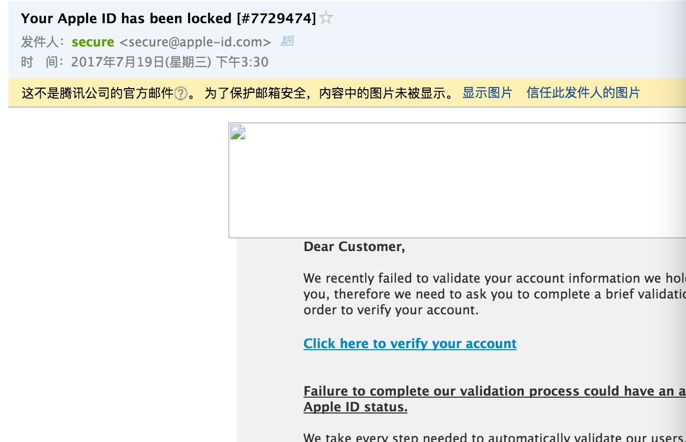
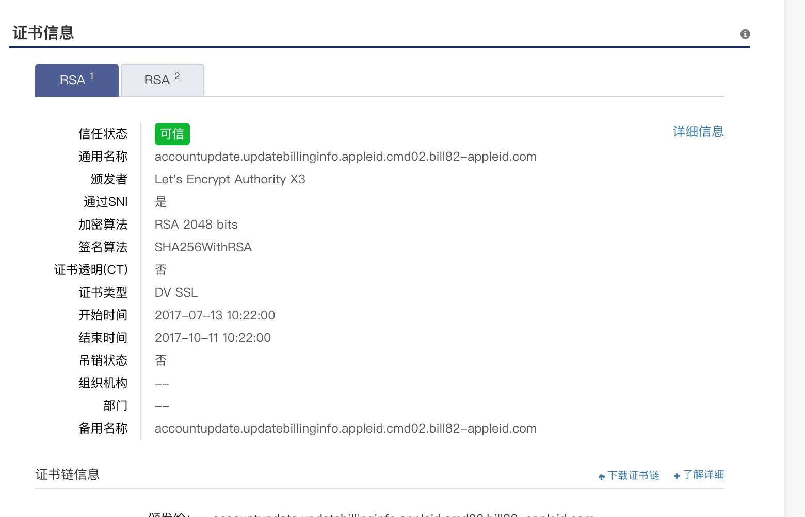
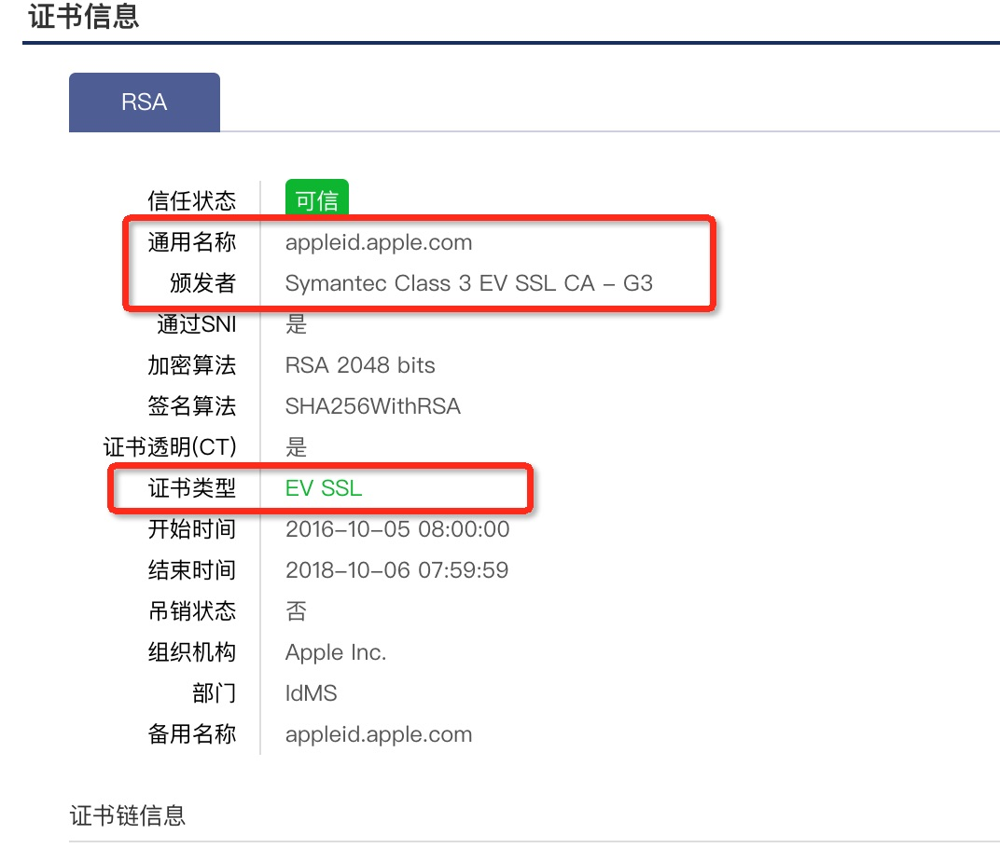

# 发现一个钓鱼网站

吃瓜群众要擦亮眼睛啊！英文的钓鱼邮件多。

（软广告）有HTTPS的绿标也一定是正牌网站，没事了到我们 [https://myssl.com](https://myssl.com) 来检测一下！

*我们不做网站认证，我们只认CA证书*

朋友收到邮件,截图如下：

点击链接跳转如下域名的地址（典型的钓鱼域名）
accountupdate.updatebillinginfo.appleid.cmd02.bill82-appleid.com

[证书检查结果](https://myssl.com/accountupdate.updatebillinginfo.appleid.cmd02.bill82-appleid.com)

比较熟悉数字证书的应该差不多确认这是一个钓鱼网站了。

# 正宗的🍎网站
[正牌网站](https://myssl.com/appleid.apple.com)

📎[网站扫描特征](accountupdate.updatebillinginfo.appleid.cmd02.bill82-appleid.com.txt)
